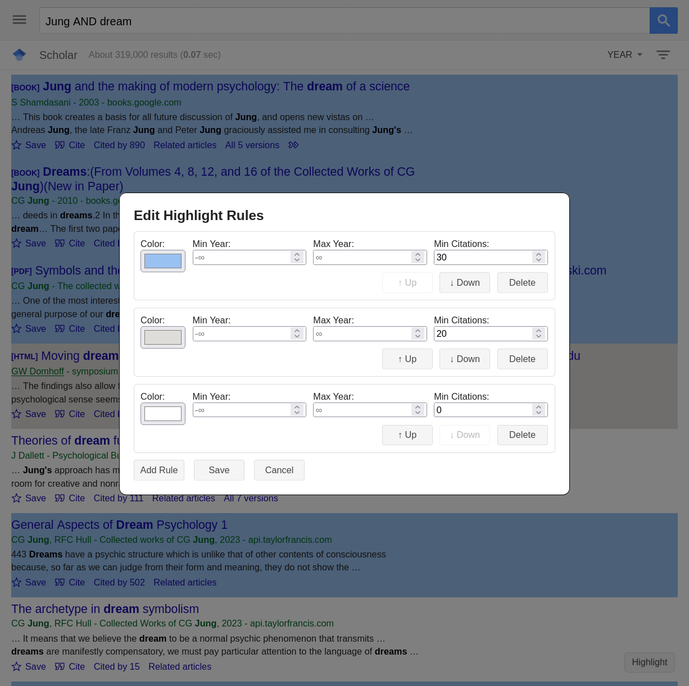
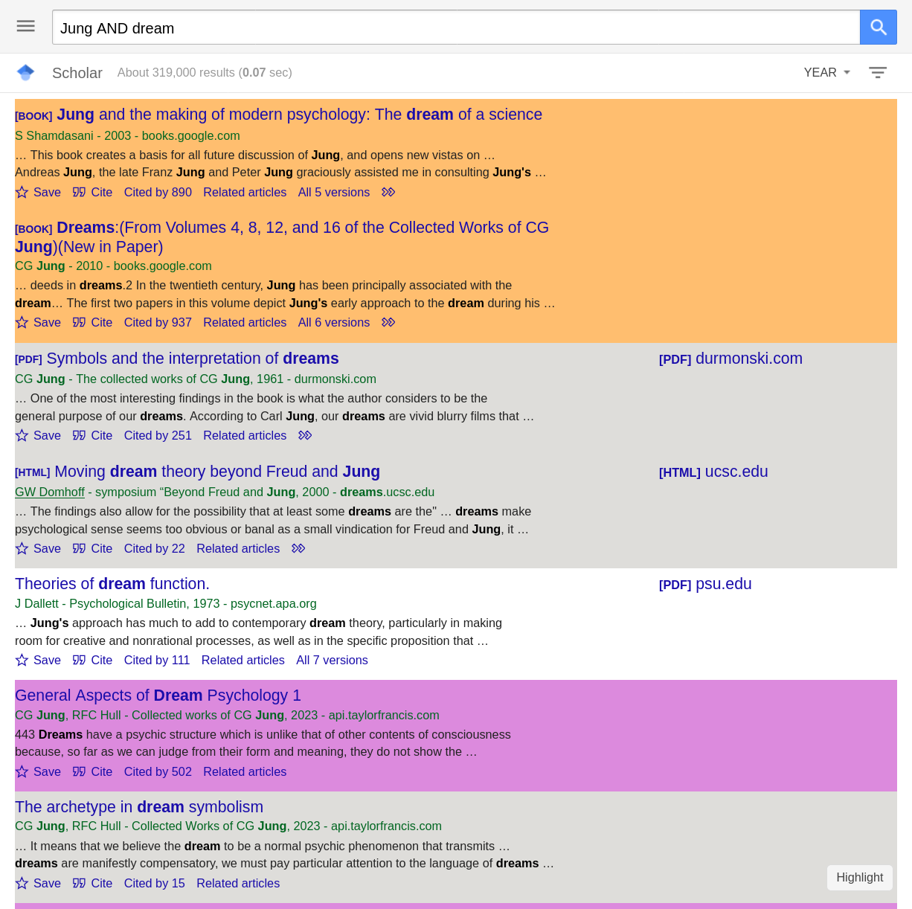
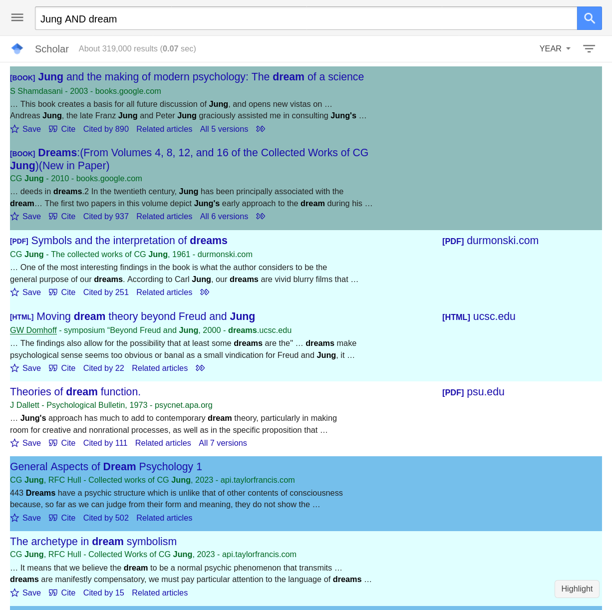

# JS-Google-Scholar-Highlighter
A JS user script for highlighting Google Scholar entries with customizable rules

## Features

Sometimes it's tiring to screen through Google Scholar's search results. This script can help you by providing:

- Easy highlighting for your desired entries

- Customizable rules for highlighting

- Simple interface to management

## Screenshots

## Installation & Usage

1. Install a user script manager

    | Script Manager | Chrome | Edge | Firefox |
    |---|---|---|---|
    | Greasemonkey | NA | NA | [link](https://addons.mozilla.org/en-US/firefox/addon/greasemonkey/)
    | Tampermonkey | [link](https://chromewebstore.google.com/detail/tampermonkey/dhdgffkkebhmkfjojejmpbldmpobfkfo) | [link](https://microsoftedge.microsoft.com/addons/detail/tampermonkey/iikmkjmpaadaobahmlepeloendndfphd) | [link](https://addons.mozilla.org/en-US/firefox/addon/tampermonkey/) |
    | Violentmonkey | [link](https://chromewebstore.google.com/detail/violentmonkey/jinjaccalgkegednnccohejagnlnfdag) | [link](https://microsoftedge.microsoft.com/addons/detail/eeagobfjdenkkddmbclomhiblgggliao) | [link](https://addons.mozilla.org/en-US/firefox/addon/violentmonkey/) |

2. Create a new user script and copy the code from [main.js](main.js) into it.

3. Visit [Google Scholar](https://scholar.google.com/scholar?hl=en&as_sdt=0%2C5&q=C.G.Jung&btnG=). You should see a `Highlight` button on the bottom right corner.

4. Click the `Highlight` and start editing your rules!

## Compatibility

This script is tested on Firefox with Greasemonkey, it should work on other browsers and script managers as well.